<p align="center">
  <picture>
    <source media="(prefers-color-scheme: dark)" srcset="docs/assets/hero-dark.svg">
    
  </picture>
</p>

<p align="center">
  
  
  
  
</p>

**knowledge-os** gives a team's AI agents a shared, evidence-first map of its systems. It installs a vault kernel, agent skills and deterministic gates into the team's own vault — never another team's knowledge — and ships `kos`, one native CLI per machine. Agents answer from sources they inspected, and what they learn goes back to the vault through Git.

## Every claim carries its grade

<p>
  <picture>
    <source media="(prefers-color-scheme: dark)" srcset="docs/assets/grades-dark.svg">
    
  </picture>
</p>

The vault is the map, not the boundary. When a note is missing or stale, the agent follows the trail to the repositories at their reference branch, the cloud snapshots, databases and trackers the cell configured. Every resource an answer names is confirmed in the notes, discovery facts or cloud snapshots; new conclusions get independent review.

For an ordinary read-only question, fresh evidence can be returned without storing it:
`kos discover run --vault <vault> --read-only` and
`kos discover platform --vault <vault> --provider <provider> --scope <scope> --read-only`.
Reuse the user's applicable read permission; storing snapshots, discovery state or notes requires write authority.
Batch note checks with repeated `--note` and add `--read-only` to prevent cache writes.


## How it works

<p align="center">
  <a href="https://rendis.github.io/knowledge-os/#onboard"><picture><source media="(prefers-color-scheme: dark)" srcset="docs/assets/flow-onboard-dark.svg">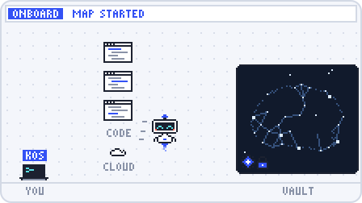</picture></a>
  <a href="https://rendis.github.io/knowledge-os/#discover"><picture><source media="(prefers-color-scheme: dark)" srcset="docs/assets/flow-discover-dark.svg">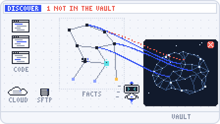</picture></a>
  <a href="https://rendis.github.io/knowledge-os/#ask"><picture><source media="(prefers-color-scheme: dark)" srcset="docs/assets/flow-ask-dark.svg">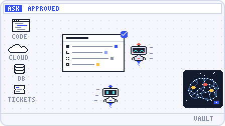</picture></a>
  <a href="https://rendis.github.io/knowledge-os/#investigate"><picture><source media="(prefers-color-scheme: dark)" srcset="docs/assets/flow-investigate-dark.svg">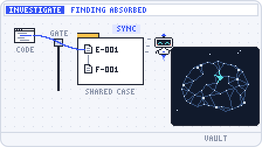</picture></a>
  <a href="https://rendis.github.io/knowledge-os/#handoff"><picture><source media="(prefers-color-scheme: dark)" srcset="docs/assets/flow-handoff-dark.svg">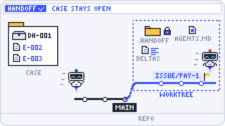</picture></a>
  <a href="https://rendis.github.io/knowledge-os/#sync"><picture><source media="(prefers-color-scheme: dark)" srcset="docs/assets/flow-sync-dark.svg">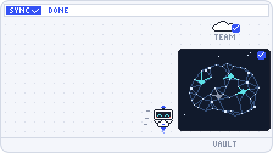</picture></a>
</p>

| | Step | What happens | With |
|:-:|---|---|---|
| 1 | **Onboard** | The cell says who it is, where its code lives and which clouds it runs on; `onboard-developer` sets up each machine once. | `kos init` |
| 2 | **Discover** | Connections extracted from repositories and read-only cloud snapshots; note gates catch stale citations. | `kos discover` |
| 3 | **Ask** | The agent answers from inspected sources with its own tools, grades each claim and checks the names it cites. | `kos discover check` |
| 4 | **Investigate** | One case per line of work, written only through the CLI and gated on every write. | `kos investigation` |
| 5 | **Hand off** | Atomic tasks in a repository worktree for any harness, reconciled back into the case. | `kos handoff` |
| 6 | **Sync** | A `sync/<slug>` branch with gates, a review bound to the exact content and a fast-forward finish. | `kos sync` |

Click a flow to watch it step by step in [the flow guide](https://rendis.github.io/knowledge-os/) (source in [`docs/flows/`](docs/flows/), published on every push to `main`). In a vault, the agent opens the matching flow when you ask how one works.

## See it run

**Discover** — three repositories and a cloud project become connections, each with its evidence.

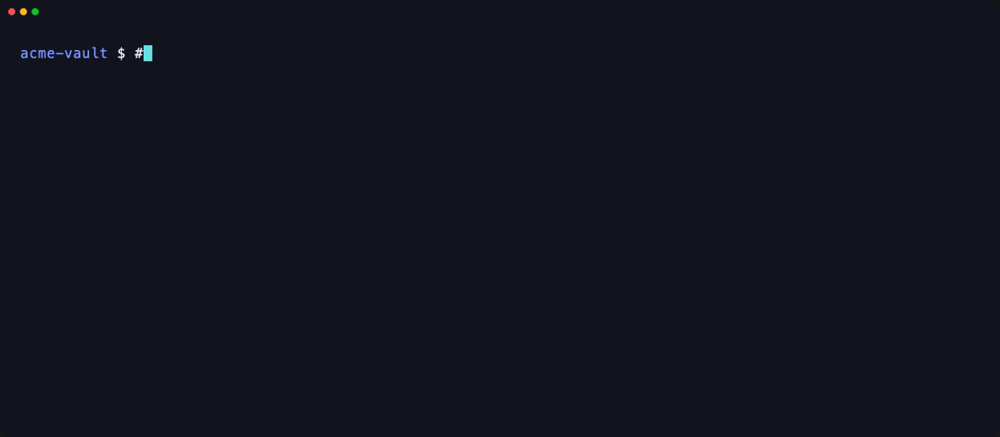

<details>
<summary><b>Investigate</b> — a claim without a source is refused</summary>
<br>
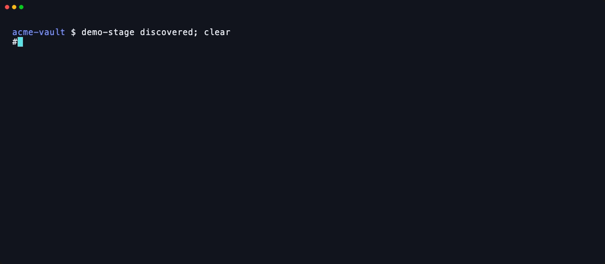
</details>

<details>
<summary><b>Hand off</b> — a task goes to a worktree and comes back as graded evidence</summary>
<br>
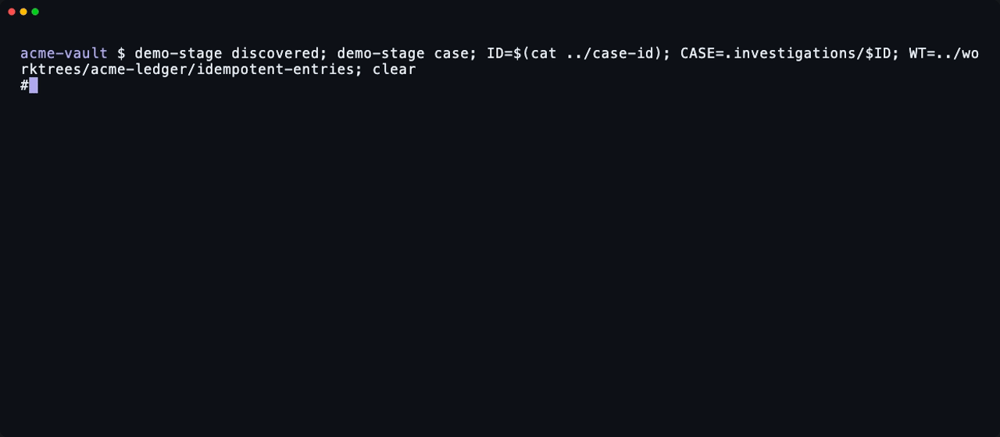
</details>

<details>
<summary><b>Sync</b> — the gate stops an orphan note until it is linked</summary>
<br>
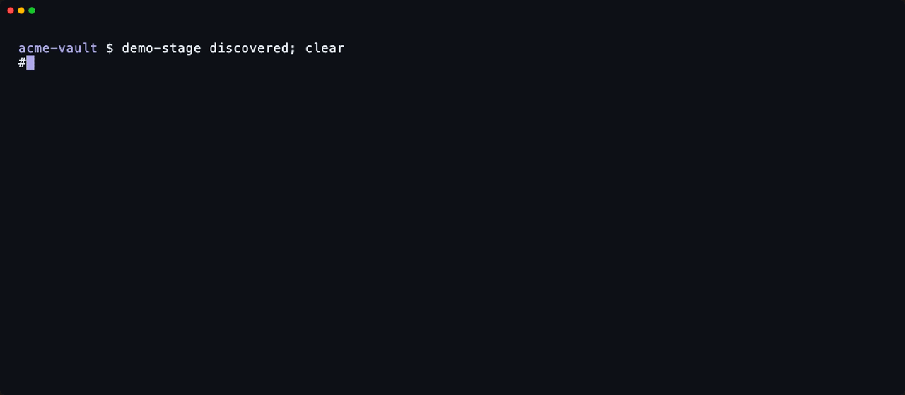
</details>

<sub>Recorded with the real <code>kos</code> against a synthetic cell (<a href="docs/demo/">docs/demo</a>); the cloud listing comes from a stubbed <code>gcloud</code>. Regenerate with <code>make demo</code>.</sub>

## Quickstart

```bash
# 1. Install kos once per machine (macOS, Linux, WSL; Windows: see the installation guide)
curl -fsSL https://github.com/rendis/knowledge-os/releases/latest/download/install-kos.sh | sh

# 2. Create the cell's vault: kos asks who the cell is, where its code lives and where it runs
kos init --vault ~/vaults/payments

# 3. Open the vault with Claude Code, Codex or Cursor: onboard-developer sets up your machine
```

Or let an agent do steps 1 and 2: paste this into Claude Code, Codex or Cursor.

```text
Install knowledge-os on this machine and create my team's cell vault.

1. If `kos version` works, run `kos update`. Otherwise install kos: on macOS, Linux or WSL
   `curl -fsSL https://github.com/rendis/knowledge-os/releases/latest/download/install-kos.sh | sh`;
   on Windows, in PowerShell, `irm https://github.com/rendis/knowledge-os/releases/latest/download/install-kos.ps1 | iex`.
   Confirm it with `kos version`.
2. Read https://raw.githubusercontent.com/rendis/knowledge-os/main/kernel/.agents/skills/onboard-cell/SKILL.md
   and follow its steps 1 to 4 with `kos` as the CLI: propose the cell's identity, repositories,
   reference branches and clouds from evidence, and confirm them with me before writing anything.
   Ask me where the vault goes.
3. Create it without prompts: `kos init --vault <path> --yes` with the confirmed answers as flags
   (`kos init --help` lists them), or `kos adopt --vault <path>` if the folder already holds notes.
4. Run `kos doctor --vault <path>` and report the result. Then tell me to open the vault in a new
   session, where onboard-developer sets up my machine and the first discovery starts.
```

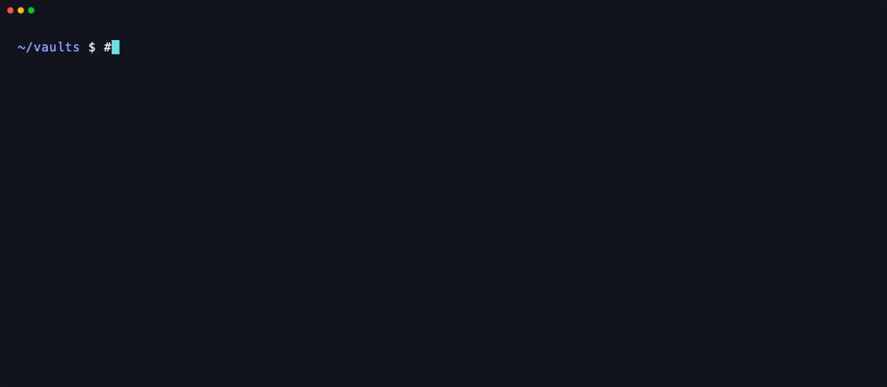

More: [installation and updates](docs/installation.md) · [the kos CLI](docs/cli.md) · [decisions](docs/adr/)

<details>
<summary><b>What the cell owns</b></summary>
<br>

The cell owns `instance.yaml`, `00-Home.md`, the root Bases, notes under `10/`–`70/` and `investigations/`. The distribution owns the `AGENTS.md` router, the generic files under `90-Meta/`, the skills and the specialist definitions; it ships no CI workflow, so the organization's pipeline never depends on `kos`. `kos kernel update` refuses kernel files edited in the vault until `--force` and never rewrites cell-owned files. Details in [installation](docs/installation.md#ownership-in-a-cell).

</details>

<details>
<summary><b>Develop this distribution</b></summary>
<br>

This repository is the **distribution**, not a cell vault; agents working on it start at [`AGENTS.md`](AGENTS.md).

| Path | Role |
|---|---|
| `cmd/`, `internal/`, `tools/` | The `kos` CLI (cells are created in `internal/cell`), its packages, release and platform-check tools |
| `scripts/` | The machine installers (`install-kos.sh`, `install-kos.ps1`), specialist and README asset rendering |
| `kernel/` | Files copied into every cell |
| `adapters/` | Optional skills a cell selects (`reports`) |
| `evals/` | Checks and benchmarks; never installed ([evals](evals/README.md)) |
| `instance.schema.yaml`, `MANAGED_PATHS` | The `instance.yaml` contract and the update allowlist |
| `docs/` | Guides, [decisions](docs/adr/) and the README images, rendered from the flow guide (`python3 -B scripts/render_readme_assets.py`, Chrome required); `docs/demo/` holds the synthetic cell and VHS tapes behind the recordings; `docs/flows/` the animated flow guide (one script per flow in `docs/flows/flows/`) |

```bash
make test            # go vet and go test
make release         # cross-platform binaries (required before the installation tests)
make test-installer
make demo            # re-record the README GIFs (vhs and jq required)
```

</details>

## License

[Apache License 2.0](LICENSE)
