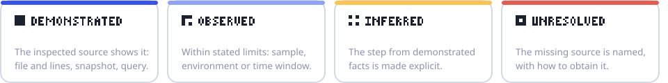

<p align="center">
  <picture>
    <source media="(prefers-color-scheme: dark)" srcset="docs/assets/hero-dark.svg">
    
  </picture>
</p>

<p align="center">
  
  
  
  
</p>

**knowledge-os** gives a team's AI agents a shared, evidence-first map of its systems. It installs a vault kernel, agent skills and deterministic gates into the team's own vault — never another team's knowledge — and ships `kos`, one native CLI per machine. Agents answer from sources they inspected, and what they learn goes back to the vault through Git.

## Every claim carries its grade

<p>
  <picture>
    <source media="(prefers-color-scheme: dark)" srcset="docs/assets/grades-dark.svg">
    
  </picture>
</p>

The vault is the map, not the boundary. When a note is missing or stale, the agent follows the trail to the repositories at their reference branch, the cloud snapshots, databases and trackers the cell configured. Answers that name resources are checked with `kos discover claims`; new conclusions get independent review.

## How it works

| | Step | What happens | With |
|:-:|---|---|---|
| 1 | **Onboard** | The cell says who it is, where its code lives and which clouds it runs on; `onboard-developer` sets up each machine once. | `install.sh init` |
| 2 | **Discover** | Connections extracted from repositories and read-only cloud snapshots; note gates catch stale citations. | `kos discover` |
| 3 | **Ask** | The agent answers from inspected sources, grades each claim and checks the names it cites. | `kos discover claims` |
| 4 | **Investigate** | One case per line of work, written only through the CLI and gated on every write. | `kos investigation` |
| 5 | **Hand off** | Atomic tasks in a repository worktree for any harness, reconciled back into the case. | `kos handoff` |
| 6 | **Publish** | A `sync/<slug>` branch with gates, a review bound to the exact content and a fast-forward finish. | `kos sync` |

## Quickstart

```bash
# 1. Install kos once per machine (the repository is private: use an account that can read it)
gh release download --repo rendis/knowledge-os --pattern install-kos.sh --output - | sh

# 2. Create the cell's vault from a checkout of this repository
gh repo clone rendis/knowledge-os && cd knowledge-os
./install.sh init --dest ~/vaults/payments

# 3. Open the vault with Claude Code, Codex or Cursor: onboard-developer sets up your machine
```

More: [installation and updates](docs/installation.md) · [the kos CLI](docs/cli.md) · [decisions](docs/adr/)

<details>
<summary><b>What the cell owns</b></summary>
<br>

The cell owns `instance.yaml`, `00-Home.md`, the root Bases, notes under `10/`–`70/` and `investigations/`. The distribution owns the `AGENTS.md` router, the generic files under `90-Meta/`, the skills and the specialist definitions. `kos kernel update` refuses kernel files edited in the vault until `--force` and never rewrites cell-owned files. Details in [installation](docs/installation.md#ownership-in-a-cell).

</details>

<details>
<summary><b>Develop this distribution</b></summary>
<br>

This repository is the **distribution**, not a cell vault; agents working on it start at [`AGENTS.md`](AGENTS.md).

| Path | Role |
|---|---|
| `install.sh`, `scripts/` | Installer (`knowledge_os.py`, with `instance.py` and `vault_catalog.py`), native runtime packaging, specialist and README asset rendering |
| `cmd/`, `internal/`, `tools/` | The `kos` CLI, its packages, release and platform-check tools |
| `kernel/` | Files copied into every cell |
| `adapters/` | Optional skills a cell selects (`reports`) |
| `evals/` | Checks and benchmarks; never installed ([evals](evals/README.md)) |
| `instance.schema.yaml`, `MANAGED_PATHS` | The `instance.yaml` contract and the update allowlist |
| `docs/` | Guides, [decisions](docs/adr/) and the README images (`python3 -B scripts/render_readme_assets.py`) |

```bash
make test            # go vet and go test
make release         # cross-platform binaries (required before the installer tests)
make test-installer
```

</details>

## License

[Apache License 2.0](LICENSE)
