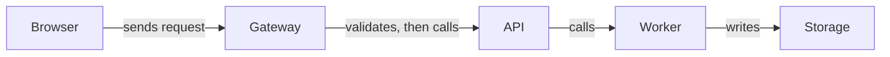

# How the request reaches storage

The diagram answers: “How does the request reach storage?” It shows only the supplied synthetic chain and does not infer timing or additional connections.

Text equivalent: Browser sends a request to Gateway; Gateway validates it and calls API; API calls Worker; Worker writes Storage.

Source boundary: Browser sends request to Gateway, Gateway validates then calls API, API calls Worker, Worker writes Storage; no other links are known. This is a synthetic fixture.
