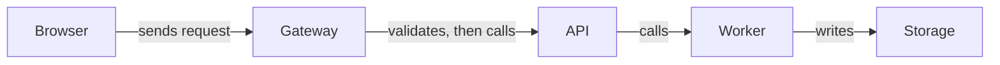

The supplied **synthetic source fixture** shows this request path:

So the request reaches storage in this order: **Browser → Gateway → API → Worker → Storage**. The fixture does not establish any other links or whether the calls are synchronous or queued.
