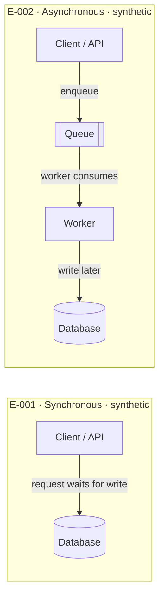

# Synthetic architecture comparison

<!-- visual-context {"files": [], "sources": ["E-001", "E-002"], "embedded": true} -->

## Purpose

Compare two supplied architecture alternatives for the existing investigation and make their tradeoffs readable without introducing measurements or runtime claims.

## Visual

## Comparison

| Criterion | E-001 · Synchronous | E-002 · Asynchronous |
| --- | --- | --- |
| Request completion | The request waits for the database write to finish. | The request enqueues work; database completion happens later. |
| Burst handling | The request path remains coupled to the write duration; capacity is not measured here. | The queue absorbs bursts in the supplied scenario; capacity and drain time are not measured here. |
| Failure and retry behavior | A write failure is visible on the waiting request; retry behavior is unspecified. | Worker retries can be isolated from the request; retry policy and delivery guarantees are unspecified. |
| Consistency | The supplied description treats the write as immediate before request completion. | Completion is eventual because the worker writes after enqueueing. |
| Decision condition | Prefer when simple request-to-write behavior and immediate completion are the priority. | Prefer when decoupling the request from writes and absorbing bursts are the priority. |

The comparison is qualitative. It does not establish throughput, latency, queue depth, retry counts, durability, or a recommendation for a production system.

## Sources and limits

E-001: synthetic description of an API writing the database synchronously; the request waits, and the design is simple.

E-002: synthetic description of an API enqueueing work for a worker that writes the database; the design absorbs bursts but completes eventually and can retry.

Generation date: 2026-09-14. No source revision or runtime observation was supplied. Mermaid rendering remains pending.
