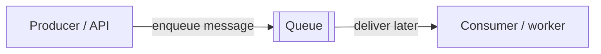

# What a queue means

Temporary synthetic illustration; not registered in the open investigation.

The queue is the waiting point. It lets the producer hand off work before the consumer is ready to process it.

Rendering status: pending.
