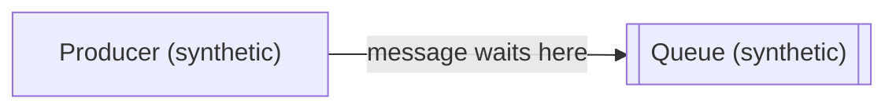

# Synthetic producer-to-queue diagram

<!-- visual-context {"files": [], "sources": ["synthetic-example"], "embedded": true} -->

## Purpose

Preserve the useful temporary explanation of a producer handing a message to a queue as a derived visual for the existing investigation. The content is intentionally synthetic and does not identify a real component or prove runtime behavior.

## Representation and reading

Read left to right: the producer places a message in the queue, where it waits for later handling. The diagram has no interactive controls.

## Sources and limits

Source: `synthetic-example`, supplied only to explain the abstract producer-to-queue relationship. This is a derived view, not primary evidence; it makes no claim about the open investigation's actual architecture, timing, durability, or delivery guarantees.

Generation date: 2026-09-14. Mermaid rendering remains pending. The case owner `manage-investigation` owns public artifact naming, hashing, and registration.
